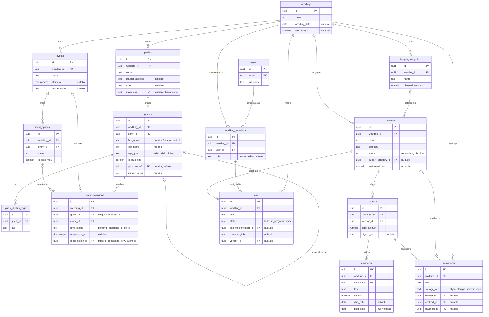

# Ever After — Data Model Design

> Phase 1 design document. No migrations or application code yet — this is the
> contract the rest of the application will be built against.
> Status: **approved — product decisions recorded in §5** · Last updated: 2026-07-20

## 1. Modeling principles

Five principles govern every table below:

1. **`wedding_id` on every row.** The wedding is the tenant. Every table carries a
   direct `wedding_id` foreign key — even where it is derivable through a join —
   because authorization checks ("does this user belong to this wedding?") become
   one indexed lookup instead of a join chain, and it keeps the door open for
   Postgres row-level security later.
2. **The atomic guest fact is (person, event).** Parties address invitations;
   people attend events. Attendance, RSVPs, and meals live on the
   guest-event row, never on the party.
3. **Derived values are computed, never stored.** Remaining balances, headcounts,
   RSVP totals, budget variance — all are queries over source facts. Stored
   aggregates drift; queries don't.
4. **UUID primary keys.** IDs appear in URLs (guest pages, RSVP links). UUIDs
   prevent enumeration ("guess `/guests/42`") and make future data merges painless.
5. **Text + CHECK constraints instead of native Postgres enums.** Adding a value
   to a `CHECK` is a cheap migration; altering a native enum is ceremony. Same
   integrity, less friction while the product is young.

All tables carry `id` (uuid), `created_at`, `updated_at` unless noted.

---

## 2. Entities

### 2.1 users

**Represents:** an authenticated account — someone who logs in. Members of the couple,
a parent, a hired planner. *Guests are not users* (they never log in; a future RSVP
portal would use tokenized links, not accounts).

**Key fields:** `email` (unique), `password_hash` (or provider id if OAuth later),
`full_name`.

**Relationships:** joins weddings only through `wedding_members` — a user has no
direct wedding column, so one account can plan or help with multiple weddings
(their own, then their sister's).

**Decisions & edge cases:** keep auth data minimal and separate from wedding-domain
data; profile enrichment can come later without touching the domain schema.

**MVP:** yes — nothing works without identity.

### 2.2 weddings

**Represents:** the wedding itself — the tenant root every other row hangs from.

**Key fields:** `name` ("Nikki & Alex"), `wedding_date` (nullable — couples sign up
before they have a date), `currency` (default `USD`), `total_budget` (nullable;
the *planned* top-line number — allowed to be stored because it is an input, not
a derived value).

**Relationships:** parent of everything; users attach via `wedding_members`.

**Decisions & edge cases:** wedding date is nullable by design — "we're engaged,
no date yet" is the product's *first* moment, not an error state. Venue details
belong on `events`, not here (the ceremony and reception may be in different places).

**MVP:** yes.

### 2.3 wedding_members

**Represents:** a user's role within one wedding — the collaboration and
permission layer.

**Key fields:** `wedding_id`, `user_id`, `role` ∈ `owner | editor | viewer`,
`invited_by`, `status` ∈ `invited | active`. Unique on (`wedding_id`, `user_id`).

**Relationships:** the join between `users` and `weddings`; `tasks.assignee_member_id`
points here (assign work to "Alex on this wedding," not "Alex globally").

**Decisions & edge cases:** three roles are enough for MVP — *owner* (the couple:
full control incl. members and deletion), *editor* (planner, parents: full data
access), *viewer* (read-only: in-laws who want to peek without breaking anything).
Per-module permissions ("can see guests but not budget" — a real request when
parents contribute money) is a later phase and slots in as a permissions column on
this table without restructuring. Invariant (application-enforced): a wedding
always has at least one owner.

**MVP:** yes — collaboration is core to the product thesis.

### 2.4 parties

**Represents:** the unit of invitation and addressing — the name on one envelope,
the group behind one RSVP link. Usually a household; deliberately not called one.

**Key fields:** `wedding_id`, `name` ("The Rivera Family"), `mailing_address`
(nullable), `side` ∈ `partner1 | partner2 | both | null` (whose people, for
list-splitting and counts), `notes`, `invite_code` (unique, nullable — reserved
for the future guest-facing RSVP portal; costs nothing now, avoids a migration
later).

**Relationships:** has many `guests`.

**Decisions & edge cases:**
- **Why not a separate `households` table?** A couple living apart can share one
  invitation; roommates at one address can get separate ones. The invitation unit
  is a *social* grouping, not a residence — so the party carries the address and a
  households table would add a join with no new information.
- A party with a single guest is normal and common — every solo invitee is a
  one-person party. The UI can hide the concept; the model keeps it uniform.
- Moving a guest between parties (data-entry fix, family drama) is a single FK
  update and must not touch their RSVPs — which it doesn't, because RSVPs hang
  off the guest.

**MVP:** yes.

### 2.5 guests

**Represents:** one human being connected to the wedding as an attendee-candidate.

**Key fields:** `wedding_id`, `party_id`, `first_name` (nullable — see plus-ones),
`last_name` (nullable), `email`, `phone` (both nullable — you rarely have contact
info for every cousin), `age_type` ∈ `adult | child | infant`,
`is_plus_one` (bool), `plus_one_of` (self-referencing guest FK, nullable),
`dietary_notes` (free text: "severe shellfish allergy — EpiPen"), `notes`.

**Relationships:** belongs to a party; optionally points at the guest who brought
them; has many `event_invitations`; has many `guest_dietary_tags`.

**Decisions & edge cases:**
- **Unnamed plus-ones are rows, not flags.** When "Jordan + guest" is decided, we
  insert a guest row with null name, `is_plus_one = true`, `plus_one_of = Jordan`.
  Headcounts, catering estimates, and (later) seating need the person to exist
  before they have a name; naming them is an `UPDATE`, not a restructure. The UI
  renders "Guest of Jordan."
- **Revoking a plus-one** is deleting that row (cascades its invitation rows) —
  clean because nothing else references an unnamed person.
- **Children** are guests with `age_type = 'child'`; infants `'infant'` typically
  don't count toward catering. The category — not a birthdate — is what caterers
  and venues actually ask for, and it never goes stale.
- **Dietary data twice, on purpose:** structured tags (next entity) for counts the
  caterer needs ("14 vegetarian, 3 gluten-free"), free-text `dietary_notes` for
  the details that don't aggregate. Dietary facts are properties of the *person*,
  not of an event or a meal choice.

**MVP:** yes.

### 2.6 guest_dietary_tags

**Represents:** one structured dietary restriction on one guest.

**Key fields:** `guest_id`, `tag` ∈ `vegetarian | vegan | gluten_free | dairy_free |
nut_allergy | shellfish_allergy | kosher | halal | other`. Unique on (`guest_id`, `tag`).

**MVP:** yes — trivial to build, and it's the difference between a caterer-ready
report and a pile of prose.

### 2.7 events

**Represents:** one gathering on the wedding weekend: ceremony, reception,
rehearsal dinner, welcome party, brunch.

**Key fields:** `wedding_id`, `name`, `starts_at`, `ends_at` (nullable),
`venue_name`, `address`, `attire`, `notes`, `sort_order`.

**Relationships:** has many `event_invitations` and `meal_options`.

**Decisions & edge cases:** modeling events as rows from day one — even though many
couples have just ceremony + reception — is the single decision that makes tiered
invitation lists ("everyone at the ceremony, close friends at the welcome party")
fall out of the schema for free. `name` is free text, not an enum: couples invent
events (sangeet, tea ceremony, afterparty) and the product should not argue.

**MVP:** yes — this is the pivot of the whole guest module.

### 2.8 event_invitations — *the load-bearing table*

**Represents:** the atomic fact "this person is invited to this event," and what
became of it. One row per (guest, event).

**Key fields:** `wedding_id`, `guest_id`, `event_id` (unique pair),
`rsvp_status` ∈ `pending | attending | declined`, `responded_at`,
`response_source` ∈ `manual | portal` (planner typed it vs. future self-serve),
`meal_option_id` (nullable FK), `notes` ("leaving after dinner").

**Relationships:** guest ↔ event join; optionally references one `meal_option`.

**Decisions & edge cases:**
- **RSVP merged into the invitation row** rather than a separate `rsvps` table:
  an RSVP cannot exist without an invitation, at most one current answer exists
  per invitation, and every screen that shows one needs the other. A separate
  table buys audit history ("changed from yes to no on May 3") at the cost of a
  join everywhere; if history matters later, an `rsvp_events` log table can be
  added *alongside* without touching this one.
- **Party-level invitations are a UI gesture, not a data structure.** "Invite the
  Riveras to the reception" expands to one row per member. Precision at the person
  level is what makes "kids welcome at the ceremony but not the reception"
  expressible without special cases.
- **Meal validity via composite foreign key:** (`event_id`, `meal_option_id`)
  references `meal_options` (`event_id`, `id`) — the database itself guarantees a
  guest's selected meal belongs to the event being responded to. No application
  bug can attach a brunch entrée to the ceremony.
- Guests uninvited after being invited: delete the row (it happens; the data
  shouldn't moralize). Plus-one rows get their invitations created by app-level
  rule: default to the host guest's events.

**MVP:** yes.

### 2.9 meal_options

**Represents:** one entrée choice offered at one event ("Braised short rib").

**Key fields:** `wedding_id`, `event_id`, `name`, `description`,
`is_kids_meal` (bool), `sort_order`.

**Decisions & edge cases:** meals belong to events (the brunch menu isn't the
reception menu). `is_kids_meal` lets the UI show only kids' meals for
`age_type = 'child'` guests — an application rule, deliberately not a DB constraint
(real weddings have adults who want the chicken tenders).

**MVP:** yes, but thin — options + one selection per guest per event. Courses,
tasting notes, and caterer export formatting are later.

### 2.10 budget_categories

**Represents:** one planned spending bucket ("Catering", "Flowers") — the backbone
of the Phase 1 Budget Center. (Not in the original entity list, but the roadmap
puts Budget Center in the MVP, and vendors/payments need something to roll up to.)

**Key fields:** `wedding_id`, `name`, `planned_amount`, `sort_order`.

**Relationships:** referenced by `vendors.budget_category_id`.

**Decisions & edge cases:** *planned* lives here (an input); *committed* is the sum
of signed contract totals in the category; *actually paid* is the sum of payments
with a `paid_date`. Three numbers, one stored, two derived — that triad is the
entire Budget Center, and later the spine of the Health Score and Scenario
Planning.

**MVP:** yes.

### 2.11 vendors

**Represents:** one business in the wedding's orbit — from "found on Instagram" to
"booked and paid," which is why this is a CRM, not an address book.

**Key fields:** `wedding_id`, `name`, `category` ∈ `venue | catering | photography |
videography | florist | music | attire | beauty | transport | stationery | rentals |
officiant | other`, `status` ∈ `researching | contacted | quote_received | booked |
declined`, `budget_category_id` (nullable FK), `contact_name`, `email`, `phone`,
`website`, `estimated_cost` (nullable — pre-booking scenario number), `notes`.

**Relationships:** has many `contracts`, `documents`, and related `tasks`.

**Decisions & edge cases:** `estimated_cost` vs. contract totals is the
research-vs-reality boundary: estimates drive "what would this cost" comparisons
while shopping; the moment a contract exists, its total supersedes the estimate in
every rollup. Multiple candidate vendors per category is the *normal* state for
months — status, not deletion, records the outcome.

**MVP:** yes (CRM basics + booked cost). Quote comparison tooling: Phase 2.

### 2.12 contracts

**Represents:** one signed agreement with a vendor — the anchor for committed money.

**Key fields:** `wedding_id`, `vendor_id`, `title` (nullable), `total_amount`,
`signed_on` (nullable), `notes`.

**Relationships:** belongs to a vendor; has many `payments`; documents attach to it.

**Decisions & edge cases:** kept separate from `vendors` (rather than folding a
`contract_total` column into the vendor) because amendments and second agreements
with the same vendor (venue rents you the space *and* the after-hours bar package)
are common enough that merging would force a redesign. MVP UI can assume one
contract per vendor; the model doesn't.

**MVP:** yes, thin.

### 2.13 payments

**Represents:** one movement of money against a contract — scheduled or completed:
deposit, installment, final balance.

**Key fields:** `wedding_id`, `contract_id`, `label` ("Deposit", "2nd installment"),
`amount`, `due_date` (nullable), `paid_date` (nullable — **null means unpaid**;
one field encodes scheduled vs. completed), `method` ∈ `card | check | transfer |
cash | other | null`, `notes`.

**Relationships:** belongs to a contract (and through it a vendor and budget
category); invoices attach as `documents` later.

**Decisions & edge cases:**
- **Remaining balance is always** `contract.total_amount − Σ payments where
  paid_date is not null` — never a column. Upcoming obligations are payments with
  a `due_date` and null `paid_date`; overdue is the same with `due_date < today`.
  The payment timeline, the "what do we still owe" panel, and payment reminders
  are all reads over this one table.
- Refunds: a negative-amount payment. Crude, honest, and sufficient until there's
  evidence of needing more.
- Payments deliberately hang off *contracts*, not vendors, so committed-vs-paid
  math never mixes with shopping-phase estimates.

**MVP:** yes — deposits and balances are a top-three anxiety.

### 2.14 tasks

**Represents:** one unit of work: "Book tasting," "Mail invitations," "Confirm
final headcount with caterer."

**Key fields:** `wedding_id`, `title`, `description`, `status` ∈ `todo |
in_progress | done`, `due_date` (nullable), `assignee_member_id` (nullable FK →
`wedding_members`), `assignee_label` (nullable text — "Mom", "Best man", "Florist"),
`vendor_id` (nullable FK), `category` (nullable text).

**Decisions & edge cases:** assignment is the interesting problem — tasks go to
the couple, family, wedding party, or vendors, and most of those people will never
have accounts. A polymorphic assignee is overengineering; instead: FK when the
assignee is a real collaborator (notifications and "my tasks" views work), free
text when they're not (a CHECK prevents both being set). If assigned humans later
need real tracking, a lightweight `people` concept can absorb the labels.
`vendor_id` links vendor-related tasks so a vendor page can show its open items.
Checklist templates ("12 months out you should…") are Phase 2 — they're content,
not schema.

**MVP:** yes.

### 2.15 documents

**Represents:** *metadata about* a file — contract PDFs, invoices, inspiration
images. Never the file itself.

**Key fields:** `wedding_id`, `title`, `category` ∈ `contract | invoice | inspiration |
correspondence | other`, `storage_key` (opaque object-storage key), `file_name`,
`mime_type`, `size_bytes`, `uploaded_by` (member FK), `vendor_id` / `contract_id` /
`payment_id` (all nullable — attach where relevant).

**Decisions & edge cases:** this is a **public portfolio repository** — private
files must be structurally impossible to commit, not merely discouraged. Bytes
live in S3-compatible object storage referenced by `storage_key`; the app serves
short-lived signed URLs; credentials live in `.env` (already gitignored); the
database stores only metadata. Multiple nullable link columns beat a polymorphic
`attachable_type/attachable_id` pair: real foreign keys the database can enforce,
at the cost of a column per new linkable entity — the right trade at three.

**MVP:** the table ships in Phase 1 (contracts want attachments immediately);
the actual upload pipeline is Phase 2 per the roadmap. Metadata-first means
Phase 2 is infrastructure work, not schema work.

---

## 3. Entity-relationship diagram

---

## 4. Key architecture decisions

1. **Wedding-per-row tenancy.** Direct `wedding_id` on every table: one-lookup
   authorization now, row-level security later.
2. **Party is addressing; guest-event is truth.** No `households` table; no
   party-level RSVPs. Tiered event lists and per-person meals fall out for free.
3. **Placeholder rows for unnamed plus-ones.** People who will exist are modeled
   as rows that already exist. Naming is an update; revoking is a delete.
4. **RSVP lives on the invitation row.** One current answer per (guest, event);
   an audit log can be added alongside later without a redesign.
5. **Composite FK guarantees meal↔event integrity** — a database-level guarantee
   that no guest selects a meal from someone else's menu.
6. **Money triad: planned (input) / committed (Σ contracts) / paid (Σ payments).**
   Balances are queries. `paid_date IS NULL` *is* the payment schedule.
7. **Documents are metadata; bytes live in object storage.** Structurally
   incapable of leaking private files into a public repo.
8. **Assignees: FK when real, label when not.** No polymorphism for people who
   will never log in.
9. **UUIDs, text+CHECK enums, timestamps everywhere** — boring, deliberate,
   migration-friendly.

## 5. Product decisions (recorded 2026-07-20)

1. **RSVP entry — planner-entered only in MVP.** Responses arrive by text, call,
   and card; the couple records them. The guest self-service portal is Phase 2;
   `parties.invite_code` keeps the schema ready for it.
2. **Budget Center — categories + vendor money.** Planned per category; committed
   and paid derived from contracts/payments. Free-form line items (`budget_items`)
   deferred until the long tail of non-vendor spending proves painful.
3. **Children — `adult | child | infant` stands.** Matches what caterers ask;
   more bands are a CHECK-constraint change if a market demands them.
4. **Wedding party — deferred to Phase 4** with seating and day-of logistics;
   a `wedding_party_roles` table drops in alongside without schema changes here.

**Still open** (no schema impact; decide when the UI forces it):

- Multiple weddings per account is supported by the model — expose a wedding
  switcher at MVP, or assume one?
- Gifts & thank-you tracking: out of scope until requested?

## 6. Recommended implementation order

Each slice = migration + API endpoints + minimal UI, shippable before the next:

1. **Identity & tenancy** — `users`, `weddings`, `wedding_members`; auth; create
   a wedding. (Everything depends on it.)
2. **Events** — small, fast win; unblocks the guest module.
3. **Parties & guests** — incl. dietary tags and plus-one mechanics.
4. **Invitations & RSVPs** — `event_invitations` + `meal_options`; the guest
   module becomes genuinely useful here.
5. **Money** — `budget_categories`, `vendors`, `contracts`, `payments`; Budget
   Center + vendor CRM.
6. **Tasks** — independent of the above; scheduled after money because budget
   anxiety beats checklist anxiety.
7. **Documents (metadata)** — table + attach points; upload infra in Phase 2.
